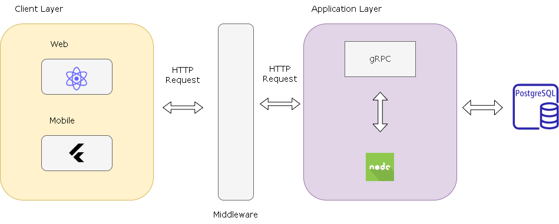
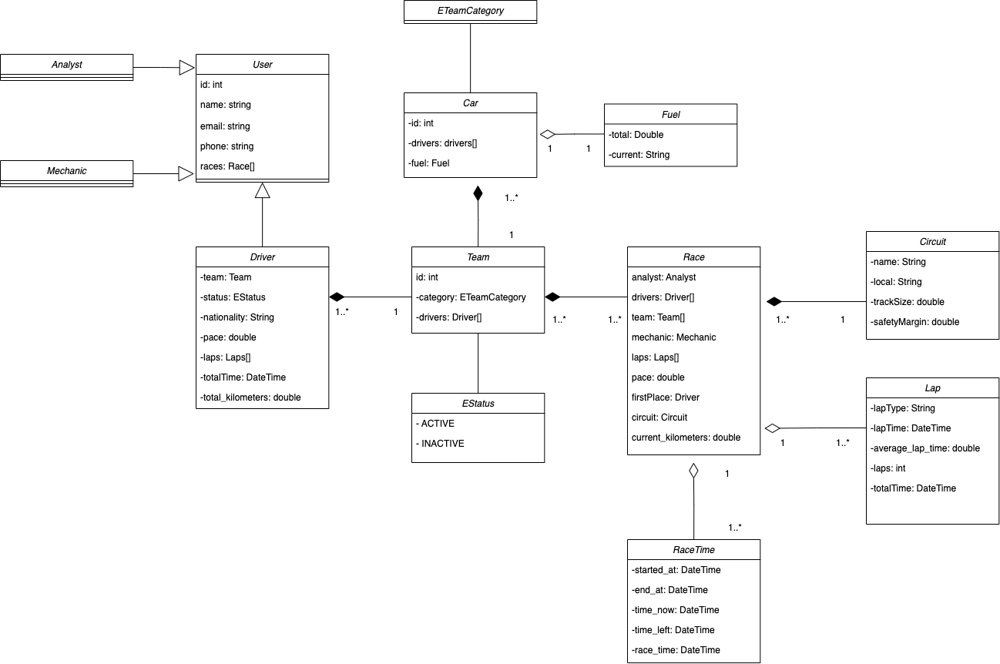
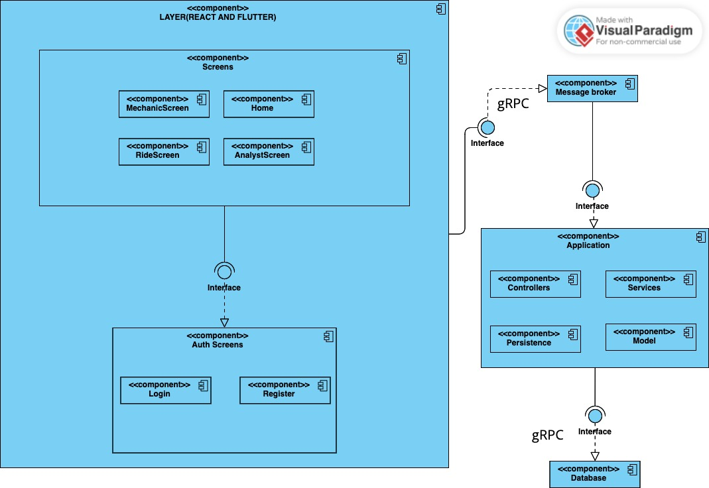
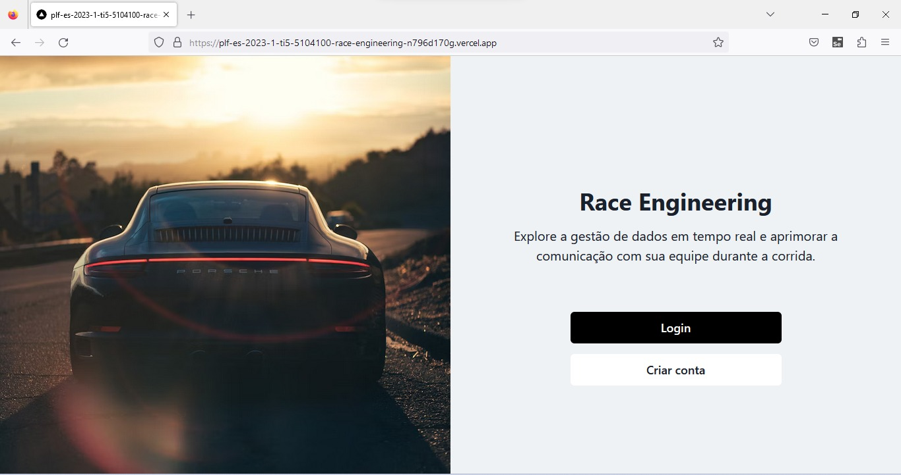
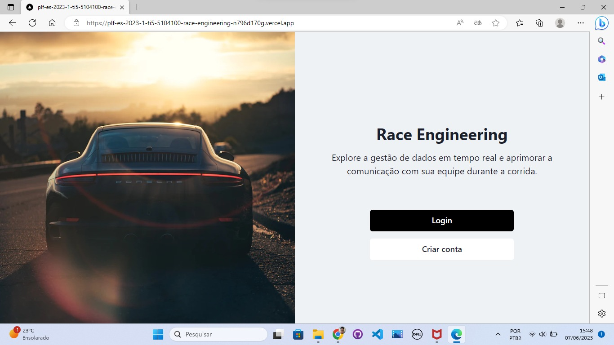
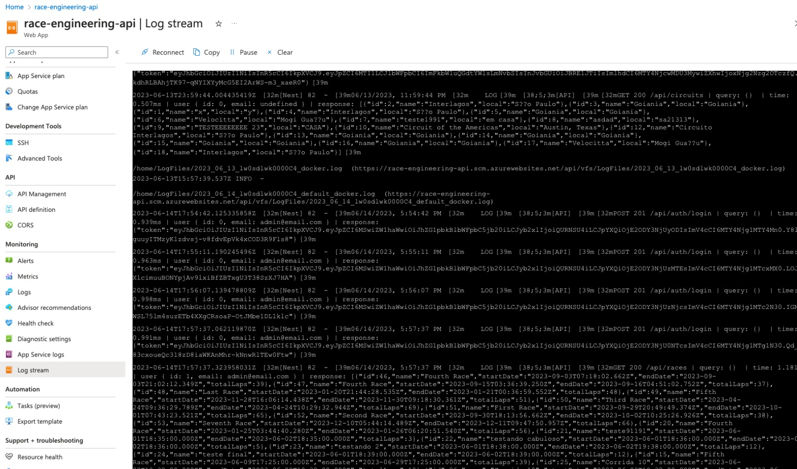
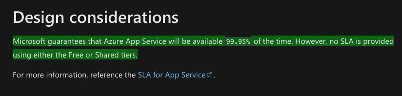
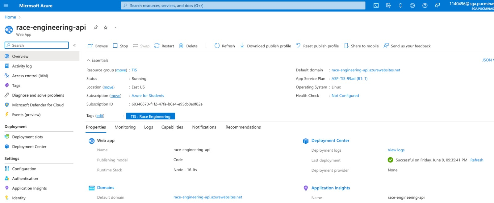
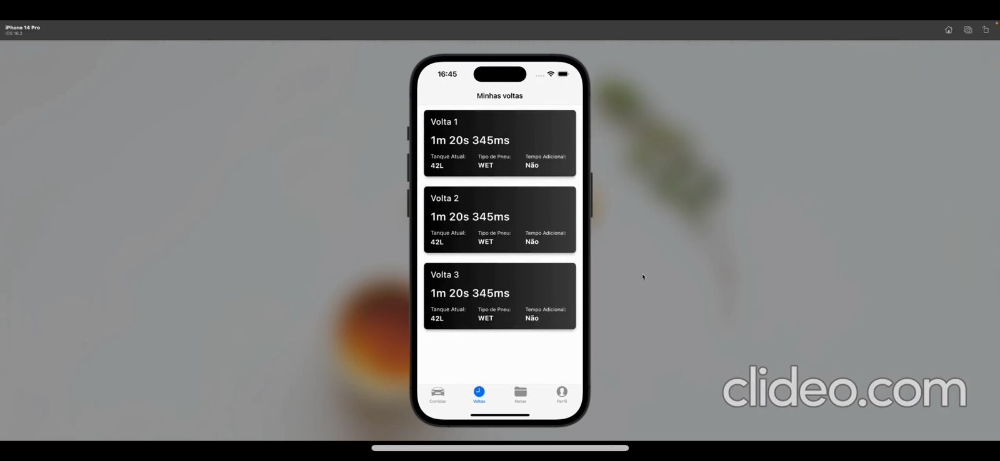
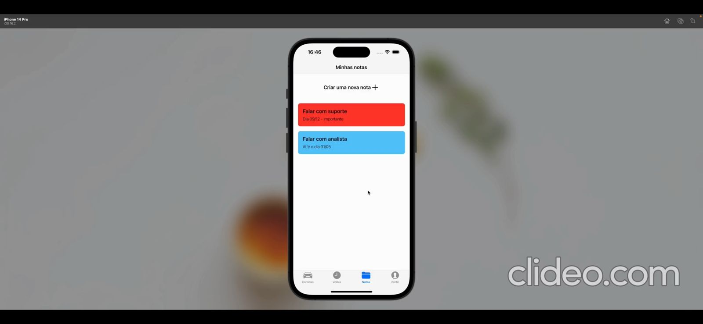

# RACE ENGINEERING 

**Ian Marcel de Campos Ferreira, ian.ferreira@sga.pucminas.br**

**Joey Clapton Maciel Barbosa Santos, jcmbsantos@sga.pucminas.br**

**Lorrayne Reis Silva, lorrayne.silva.1220819@sga.pucminas.br**

**Octávio Oliveira Rocha, octavio.rocha@sga.pucminas.br**

**Vitor de Souza Xavier, vitor.xavier@sga.pucminas.br**

**Vítor José Lara Bastos, vitor.bastos@sga.pucminas.br**

---

Professores:

**Cleiton Silva Tavares**

**Aline Norberta de Brito**

---

_Curso de Engenharia de Software, Unidade Praça da Liberdade_

_Instituto de Informática e Ciências Exatas – Pontifícia Universidade de Minas Gerais (PUC MINAS), Belo Horizonte – MG – Brasil_

---

---

## Histórico de Revisões

| **Data** | **Autor** | **Descrição** | **Versão** |
| --- | --- | --- | --- |
| **[dd/mm/aaaa]** | [Nome do autor] | [Descrever as principais alterações realizadas no documento, evidenciando as seções ou capítulos alterados] | [X] |
| **23/02/2023**| Lorrayne Reis| Cabeçalho inicial e resumo | 1.0 |
| **27/02/2023**| Ian Marcel| Requisitos Funcionais e Não Funcionais | 1.0 |
| **28/02/2023**| Lorrayne Reis| Sessão Apresentação Completa | 1.0 |
| **01/03/2023**| Vítor José| Modelagem e projeto arquitetural | 1.0 |
| **01/03/2023** | Joey Clapton | Mecanismos arquiteturais e Visão de negócio| 1.0 |
| **05/03/2023**| Lorrayne| Alteração Requisitos Funcionais e Não Funcionais | 1.1 |
| **05/03/2023**| Lorrayne| Alteração restrição arquitetural | 1.1 |
|**06/03/2023** | Lorrayne Reis | Mecanismos arquiteturais e Visão de negócio| 1.1 |
| | | | |

## SUMÁRIO

1. [Apresentação](#apresentacao "Apresentação")  
	1.1. Problema  
	1.2. Objetivos do trabalho  
	1.3. Definições e Abreviaturas  

2. [Requisitos](#requisitos "Requisitos")  
'	2.1. Requisitos Funcionais  
	2.2. Requisitos Não-Funcionais  
	2.3. Restrições Arquiteturais  
	2.4. Mecanismos Arquiteturais  

3. [Modelagem](#modelagem "Modelagem e projeto arquitetural")  
	3.1. Visão de Negócio  
	3.2. Visão Lógica  
	3.3. Modelo de dados (opcional)  

4. [Avaliação](#avaliacao "Avaliação da Arquitetura")  
	4.1. Cenários  
	4.2. Avaliação  

5. [Referências](#referencias "REFERÊNCIAS") 

6. [Apêndices](#apendices "APÊNDICES") 

# 1. Apresentação

<div align="justify"

*Porsche Carrera Cup* é uma competição automobilística que utiliza apenas *Porsche Carrera* preparados para as pistas, o Brasil passou a ter seu campeonato com 2005. Essa é inteiramente organizada por uma única empresa, possibilitando igualdade de preparação para todos os competidores. O piloto não tem qualquer preocupação com a preparação dos automóveis, ele precisa apenas chegar ao autódromo e correr. 

Nas corridas de *Endurance* são 60 pilotos, distribuídos em 30 carros disputando provas de 300 km e 500 km compostos de três etapas. As duas primeiras corridas são disputadas em duplas e duram 300 km ou 2h45min (o que acontecer primeiro). A prova final, de 500 km, distribui mais pontos e pode ser disputada em trio ou dupla. As etapas acontecem em diferentes pistas e partes do país, com competidores pontuando individualmente no campeonato de Endurance, conforme seus resultados em cada etapa, mas uma dupla pode ser campeã em conjunto. Nas duas primeiras corridas, as vitórias valem 68 pontos. Na terceira, 116. 

Cada time é responsável por definir sua estratégia de revezamento, trocas de pneus e reabastecimento durante as paradas no *box*. Nas provas de 300 km há três *pit-stops* obrigatórios com tempo mínimo de 6 minutos cada. Na prova de 500 km são cinco *pits* obrigatórios. Não é permitido trocar pneu e reabastecer simultaneamente. Cada piloto tem que realizar uma quilometragem mínima para validar o resultado do carro. No Velocitta o mínimo corresponde a 36 voltas, em Goiânia são 32 e, em Interlagos 48 (para tripulações competindo em duplas) ou 32 (para os trios). O *quali* acontece com quatro sessões de 10 minutos e todos os pilotos necessariamente têm que ir para a pista nas duas primeiras etapas.  

Na etapa de 500 km, no caso de tripulações com três pilotos, participam do *quali* os competidores de maior e menor *BOP*. *BoP* (*Balance of Performance*) equalizam os carros com lastros distribuídos de acordo com o repertório e idade dos pilotos e determinam também deduções de tempo nas paradas obrigatórias para revezamento dos pilotos. Os carros aceleram separadamente no treino de formação do *grid* de largada. Primeiro registram voltas os competidores de menor *BOP*, na sessão seguinte, os de maior *BOP*. O *grid* é apurado pela média das melhores voltas de cada piloto. Se houver empate na média, leva vantagem o carro que tiver registrado a melhor passagem em termos absolutos. 

## 1.1. Problema

A problemática se instaura na grande quantidade de informações a serem rastreadas e mantidas no pré, durante e pós-corrida para definição de estratégias e *performance*. Logo, é necessário um controle de corridas, pilotos, *laps* e consumo de combustível, em sua maioria realizado via planilhas de Excel ou em papel de modo arcaico. Diversos engenheiros afirmam que as planilhas já falharam durante corridas, comprometendo performance e levando a perda de pontos em campeonato. Outra problemática em dominância se demonstra na não absorção de informações ou baixo entendimentos de Engenheiro Mecânico e Pilotos ao se perderem nas informações fornecidas pelas planilhas, além de necessitarem algumas vezes de apenas informações referenciais de sua atuação e não possuírem uma visão única para tal. Ademais, durante corrida o Engenheiro de pista quando ocorre a troca de pilotos do carro, precisa passar informações constantemente ao piloto que saiu do carro sobre sua performance, o que leva a perda de tempo com piloto principal que está no carro atuando.

## 1.2. Objetivos do trabalho

O objetivo central do trabalho se concentra em desenvolver um *software* com as duas problemáticas principais demonstradas no tópico anterior: gerenciamento total de corridas e visões de *performance* diferentes. Para isso serão desenvolvidas uma aplicação *mobile* e uma *web* com o intuito de focalizar o processo de diferentes *views* atendendo necessidades de todas as partes interessadas. Objetivando uma aplicação que vise possibilitar o gerenciamento de informações por parte do Engenheiro de Pista, oferecendo informações previsionais de clima, permitindo visualização de performance ao piloto, demonstrando informações de tempo e voltas decorrentes e provendo um *chat* entre os envolvidos. Os pontos principais aprofundados se concentram na atualização de informações em tempo real a todos os desenvolvidos, o armazenamento de informações e o *chat* para comunicação. 
 

## 1.3. Definições e Abreviaturas

*Porsche Carrera Cup* – Corridas realizadas com o carro Porsche Carrera. 

*Porsche Carrera* – *Porsche* utilizado nas corridas que possui pequenas alterações para ser utilizado em pistas. 

Corridas de *Endurance* – Corridas de longa duração ou com maior duração que as corridas *Porsche Sprint*. 

*Box* - Local no autódromo destinado a alocamento de uma equipe durante a corrida.

*Laps* - Voltas realizadas pelos pilotos no circuito.

Estratégia de revezamento - Estratégia calculada para definir quantas voltas o piloto principal vai fazer no carro e quantas voltas o piloto secundário vai realizar no objetivo de obter maior *performance*. 

*Pit-stops* - Paragem durante uma corrida na área das boxes onde se encontram as equipes e seus mecânicos, para que durante a corrida os pilotos possam trocar de pneus, fazer o reabastecimento de combustível dos seus veículos ou realizar a troca entre pilotos. 

*Quali* - O "*Quali*" vem de "*Qualifying*", que em inglês quer dizer "Qualificação" ou "Classificação". E, como a ordem numérica sugere, são as fases do treino de classificação que define o *grid* de largada na corrida. 

*BOP* -  *Balance of Performance* , equalizam os carros com lastros distribuídos de acordo com o repertório e idade dos pilotos e determinam também deduções de tempo nas paradas obrigatórias para revezamento dos pilotos. 

*Grid* de largada – Local onde todos os carros se reúnem com definição marcada  e de posição de classificação para o começo da corrida.

*Performance* - Realizar, completar, executar ou efetivar. 
 

# 2. Requisitos

_Esta seção descreve os requisitos comtemplados nesta descrição arquitetural, divididos em dois grupos: funcionais e não funcionais._

## 2.1. Requisitos Funcionais
| **ID** | **Descrição** | **Prioridade** | **Finalizado** |
| --- | --- | --- | --- |
| RF001 | O sistema deve permitir que o usuário realize o cadastro na plataforma Web | Obrigatório | ✅
| RF002 | O sistema deve permitir que o usuário acesse a plataforma Web utilizando o e-mail e senha cadastrados anteriormente | Obrigatório | ✅
| RF004 | O sistema deve permitir que o usuário cadastre uma corrida após acessar a plataforma Web | Obrigatório | ✅
| RF005 | O sistema deve permitir que o usuário cadastre uma corrida com todas as informações necessárias após acessar a plataforma Web | Obrigatório | ✅
| RF006 | O sistema deve permitir que o usuário visualize as corridas e os locais registrados após acessar a plataforma Web | Obrigatório | ✅
| RF007 | O sistema deve permitir que o usuário associe pilotos e mecânicos a uma corrida após acessar a plataforma Web | Obrigatório | ✅
| RF008 | O sistema deve permitir que o usuário faça o login no aplicativo | Obrigatório | ✅
| RF009 | O sistema deve permitir que o usuário acesse o aplicativo utilizando o e-mail e senha cadastrados anteriormente | Obrigatório | ✅
| RF010 | O sistema deve permitir que o usuário visualize as corridas associadas a ele após acessar o aplicativo | Obrigatório | ✅
| RF011 | O sistema deve permitir que o usuário visualize informações climáticas após acessar a plataforma Web | Obrigatório | ✅
| RF012 | O sistema deve permitir que o usuário insira dados informativos sobre a corrida após acessar a plataforma Web | Obrigatório | ✅
| RF013 | O sistema deve permitir que o usuário salve os dados da corrida após acessar a plataforma Web | Obrigatório | ✅
| RF014 | O sistema deve permitir que o mecânico consulte informações sobre os pneus durante a corrida após acessar o aplicativo | Essencial | ⏳
| RF015 | O sistema deve permitir que o piloto consulte informações sobre o número de voltas após acessar o aplicativo | Essencial |  ✅

Obs: acrescente mais linhas, se necessário.

## 2.2. Requisitos Não-Funcionais

| **ID** | **Descrição** |
| --- | --- |
| RNF001 | O tempo de resposta das consultas deve ser inferior a 5 segundos|
| RNF002 | O software deve ser compátivel com os sistemas Android e IOS|
| RNF003 | A versão web da aplicação deve operar corretamente nos seguintes navegadores: Google Chrome, Edge e Firefox|
| RNF004 | O usuário deve estar autentificado e relacionado a um tipo para vizualizar informações e realizar ações.|
| RNF005 | A aplicação deve estar disponível quando necessária para utilização .|
| RNF006 | Os ícones e símbologias devem ser intuitivos também para pessoas que não atuam com corridas .|

## 2.3. Restrições Arquiteturais

As restrições impostas ao projeto que afetam sua arquitetura são:

- A camada de apresentação front-end deverá ser desenvolvida usando o framework Next.js;
- A aplicação backend deverá utilizar NestJS com o ORM TypeORM;
- A aplicação mobile deverá utilizar Flutter com Postgresql;
- As aplicações mobile, back-end e front-end deverão estar em ambientes na nuvem;
- Não deverá ser usado o firebase como arquitetura de mensageria;
- O aplicativo será funcional em dispositivos celulares Android e IOS os quais devem ter acesso a internet;
- O frontend deve ser desenvolvido para consumir diferentes serviços de APIs diferentes, portanto um módulo não pode interferir no outro;
- O serviço de autenticação de usuários será fornecido por uma API externa.

## 2.4. Mecanismos Arquiteturais

| **Análise** | **Design** | **Implementação** |
| --- | --- | --- |
| **Análise** | **Design** | **Implementação** |
| --- | --- | --- |
| Persistência | ORM Hibernate | Utiliza o Hibernate para mapear objetos de software para registros em um banco de dados relacional. |
| Front end | API com Next.js | Criação de API com o framework Next.js para facilitar a criação de aplicações web.|
| Back end | API com Nest.js e ORM TypeORM | Criação de API com a linguagem Node.js e ORM TypeORM para a manipulação de dados no banco de dados. |
| Integração | API com ORM TypeORM | Utilização de APIs com o ORM TypeORM para integração de diferentes partes do sistema. |
| Log do sistema | Web services com Node.js | Implementação de web services com Node.js para registro de logs do sistema. |
| Teste de Software | API com Postman | Teste de software realizado por meio do Postman, que é uma plataforma para testes de APIs. |
| Deploy | API com Node.js | Deploy da aplicação realizado por meio da API com Node.js. |

# 3. Modelagem e projeto arquitetural

Para solucionar o problema proposto, difiniu-se a estratégia arquitetural que se baseia na utlização do React para o desenvolvimento web e Flutter para o mobile, ambos sendo ultizados no Fornt-End e se encaixando no Client Layer. Entrando na Application Layer, a linguagem Node.Js será abordada para o desenvolvimento do Back-End e o protocolo que garantirá uma comunicação rápida e eficiente será o gRPC com Rest API, que garantirá uma economia de tempo e recursos dentro do presente sistema distribuído.
	
A comunicação entre o Cliente Layer e a Application layer será feita por meio de requests usando o protocolo HTTP, tendo como intermediário entre estas duas aplicações o Software Middleware, que trará uma melhor eficiência, simplificará a manutenção do sistema através de seus serviços de integração, segurança e gerenciamento de rede.
	
Será utilizado o PostgreSQL como banco de dados devido à sua robustez, flexibilidade e confiabilidade. O PostgreSQL suporta grandes volumes de dados e alta demanda de acesso simultâneo, além de oferecer recursos avançados como suporte para SQL avançado, integridade referencial e transações ACID, além de possuir uma comunidade ativa de desenvolvedores, o PostgreSQL pode ser executado em diversas plataformas e é uma escolha confiável e eficiente para projetos de diferentes tamanhos e complexidades.

**Figura 1 - Diagrama de visão geral**
	

## 3.1. Visão de Negócio (Funcionalidades)

1. O sistema deve prover acesso aos pilotos, mecânicos e analista
2. O sistema deve permitir cadastro de corridas
3. O sistema deve permitir a consulta de dados da corrida
4. O sistema deve permitir o cadastro de dados da corrida
5. O sistema deve fazer cálculos baseados nos dados da corrida e gerar informações baseadas no dados

Obs: a quantidade e o escopo das funcionalidades deve ser negociado com os professores/orientadores do trabalho.

### Descrição resumida dos Casos de Uso / Histórias de Usuário

### Casos de uso:

#### UC01 – Consulta de dados da corrida

| **Descrição**             | Eu como usuário visualizar dados da corrida          |
| ------------------------- | ---------------------------------------------------- |
| **Atores**                | Mecânico                                             |
| **Prioridade**            | Alta                                                 |
| **Requisitos associados** | RF006, RF016                                              |
| **Fluxo Principal**       | Fazer login no sistema e consultar dados da corrida |

#### UC02 – Cadastro de corrida
| **Descrição**             | Eu como usuário quero poder cadastrar uma corrida       |
| ------------------------- | ---------------------------------------------------- |
| **Atores**                | Usuario                                             |
| **Prioridade**            | Alta                                                 |
| **Requisitos associados** | RF005                                               |
| **Fluxo Principal**       | Fazer login no sistema e cadastrar uma corrida |

#### UC03 – Consulta de tempo de volta da corrida

| **Descrição**             | Eu como usuário visualizar o tempo de cada volta da corrida        |
| ------------------------- | ---------------------------------------------------- |
| **Atores**                | Piloto                                           |
| **Prioridade**            | Alta                                                 |
| **Requisitos associados** | RF024                                               |
| **Fluxo Principal**       | Fazer login no sistema e consultar dados das voltas |

#### UC04 – Cadastro de dados da corrida
| **Descrição**             | Eu como usuário quero poder cadastrar dados da corrida       |
| ------------------------- | ---------------------------------------------------- |
| **Atores**                | Analista                                             |
| **Prioridade**            | Média                                                 |
| **Requisitos associados** | RF004                                                |
| **Fluxo Principal**       | Fazer login no sistema e cadastrar dados da corrida |

#### UC05 – Consultar clima de uma localidade
| **Descrição**             | Eu como usuário quero poder visualizar o clima de uma localidade    |
| ------------------------- | ---------------------------------------------------- |
| **Atores**                | Analista                                             |
| **Prioridade**            | Média                                                 |
| **Requisitos associados** | RF005                                               |
| **Fluxo Principal**       | Fazer login no sistema e consultar o clima de uma localidade|

### Histórias de usuário
- Como mecânico quero poder visualizar dados da corrida
- Como usuário que poder cadastrar uma corrida
- Como analista quero poder visualizar o tempo de cada volta da corrida
- Como analista quero poder cadastrar dados de um corrida
- Como analista quero poder visualizar o clima de uma localidade para prever mudanças no planejamento da corrida

## 3.2. Visão Lógica

_Apresente os artefatos que serão utilizados descrevendo em linhas gerais as motivações que levaram a equipe a utilizar estes diagramas._

### Diagrama de Classes

**Figura 2 – Diagrama de classes. Fonte: o próprio autor.**

Entidade: 
- User: usuário do sistema que representa uma entidade abstrata
- Analyst: usuário do tipo analista representando uma instância da entidade User
- Mechanic: usuário do tipo mecânico representando uma instância da entidade User
- Driver: usuário do tipo piloto representando uma instância da entidade User
- Team: equipes responsáveis que irão participar das provas
- Car: são os carros das equipes que disputarão as provas
- Race: entidade que contém todas as informações da corrida
- Lap: entidade que contém as informações das voltas
- Circuit: entidade que contém as informações do cirtuito em que se realizarão as provas

### Diagrama de componentes

**Figura 3 – Diagrama de Componentes. Fonte: o próprio autor.**

_Apresente uma descrição detalhada dos artefatos que constituem o diagrama de implantação._

- Componente Home: tela onde irá conter todas as infomações sobre o usuário
- Componente Analyst screen: tela com os dados do analista
- Componente Ride screen: tela com os dados do piloto
- Componente Mechanical screen: tela com os dados do mecânico
- Componente Auth: telas que utilização do serviço de autenticação do usuário
- Componente Login: tela para login do usuário no sistema
- Componente Register: tela para registro do usuário no sistema
- Componente Database: entidade para persistência de dados

## 3.3. Modelo de dados (opcional)

_Caso julgue necessário para explicar a arquitetura, apresente o diagrama de classes ou diagrama de Entidade/Relacionamentos ou tabelas do banco de dados. Este modelo pode ser essencial caso a arquitetura utilize uma solução de banco de dados distribuídos ou um banco NoSQL._

 ")

**Figura 4 – Diagrama de Entidade Relacionamento (ER) - exemplo. Fonte: o próprio autor.**

Obs: Acrescente uma breve descrição sobre o diagrama apresentado na Figura 3.

# 4. Avaliação da Arquitetura
	
_Esta seção descreve a avaliação da arquitetura apresentada, baseada no método ATAM._

## 4.1. Cenários

**Cenário 1 - Compatibilidade:** A compatibilidade busca a averiguação do funcionamento do projeto nas plataformas Android e IOS de modo a provar a não restrição de performance desse frente a diferente ambientes.

**Cenário 2 - Adaptabilidade:** A adaptabilidade deseja promover a utilização do software a partir de diferentes navegadores como Google Chrome, Edge e Firefox .

**Cenário 3 - Segurança:** A segurança promove a restrição de atuação para diferentes usuários, uma vez que os mesmos são bem definidos em relação a sua atuação e utilização de ferramentas.

**Cenário 4 - Disponibilidade:** A disponibilidade visa avaliar a provisão temporal do software em relação a sua possibilidade de utilização.

**Cenário 5 - Acessibilidade:** A acessibilidade visa averiguar utilização do software em seu aspecto vizualizativo por parte dos utentes.

## 4.2. Avaliação

_Apresente as medidas registradas na coleta de dados. O que não for possível quantificar apresente uma justificativa baseada em evidências qualitativas que suportam o atendimento do requisito não-funcional. Apresente uma avaliação geral da arquitetura indicando os pontos fortes e as limitações da arquitetura proposta._

| **Atributo de Qualidade:** | Compatibilidade|
| --- | --- |
| **Requisito de Qualidade** | Compatibilidade as plataformas Android e IOS |
| **Preocupação:** | A instalação do sistema deve ser suportada nos dispositivos móveis com sistemas Android e IOS |
| **Cenários(s):** | Cenário 1 |
| **Ambiente:** | Sistemas operacionais Android e IOS|
| **Estímulo:** | Emulação da aplicação nos ambientes requiridos |
| **Mecanismo:** | Input nos campos de login |
| **Medida de Resposta:** | Login efetuado |

**Considerações sobre a arquitetura:**

| **Riscos:** | Não existe |
| --- | --- |
| **Pontos de Sensibilidade:** | Não existe |
| _ **Tradeoff** _ **:** | Não existe |
	

	
	
| **Atributo de Qualidade:** | Adaptabilidade |
| --- | --- |
| **Requisito de Qualidade** | O sistema deve estar disponível nas modalidades mobile e web |
| **Preocupação:** | O sistema deve ser acessível nos navegadores Google Chrome, Edge e Firefox |
| **Cenários(s):** | Cenário 2 |
| **Ambiente:** | Plataforma Web |
| **Estímulo:** | Acessar o sistema em diferentes navegadores |
| **Mecanismo:** | Acesso via web a aplicação |
| **Medida de Resposta:** | Vizualização de tela inicial |

**Considerações sobre a arquitetura:**

| **Riscos:** | Não existe |
| --- | --- |
| **Pontos de Sensibilidade:** | Não existe |
| _ **Tradeoff** _ **:** | Não existe |
	
	

	
| **Atributo de Qualidade:** | Segurança |
| --- | --- |
| **Requisito de Qualidade** | Acesso aos recursos restritos deve ser controlado |
| **Preocupação:** | Os acessos de usuários devem ser controlados de forma que cada um tenha acesso apenas aos recursos condizentes as suas atuações. |
| **Cenários(s):** | Cenário 3|
| **Ambiente:** | Plataforma web e mobile |
| **Estímulo:** | Acesso do analista a página de estratégia. |
| **Mecanismo:** | Login como analista do Web |
| **Medida de Resposta:** | Criação de estratégia  |
	

**Considerações sobre a arquitetura:**

| **Riscos:** | Não existe |
| --- | --- |
| **Pontos de Sensibilidade:** | Não existe |
| _ **Tradeoff** _ **:** | Não existe |
	

	
	
| **Atributo de Qualidade:** | Disponibilidade |
| --- | --- |
| **Requisito de Qualidade** | A aplicação deve estar disponível para acesso do usuário|
| **Preocupação:** | Desde que tenha acesso a internet, o usuário deve acessar a aplicação a qualquer momento |
| **Cenários(s):** | Cenário 4 |
| **Ambiente:** | Sistema em operação normal |
| **Estímulo:** | Ao utilizar a aplicação a percepção do usuário é um sistema funcionando sem interrupções|
| **Mecanismo:** | Solicitação de uma requisição ao servidor |
| **Medida de Resposta:** | A aplicação deve responder a solicitação do usuário|

**Considerações sobre a arquitetura:**

| **Riscos:** | Não existe |
| --- | --- |
| **Pontos de Sensibilidade:** | Não existe |
| _ **Tradeoff** _ **:** | Não existe |
 

	
	
| **Atributo de Qualidade:** | Acessibilidade |
| --- | --- |
| **Requisito de Qualidade** | Os ícones e telas da aplicação devem ser intuitivos|
| **Preocupação:** | Os usuários precisam navegar em uma plataforma organizada |
| **Cenários(s):** | Cenário 5 |
| **Ambiente:** | Telas do sistema |
| **Estímulo:** | Navegação nos principais fluxos do sistema |
| **Mecanismo:** | |
| **Medida de Resposta:** |  |

**Considerações sobre a arquitetura:**

| **Riscos:** | Não existe |
| --- | --- |
| **Pontos de Sensibilidade:** | Não existe |
| _ **Tradeoff** _ **:** | Não existe |

Evidências dos testes realizados
	

_Apresente imagens, descreva os testes de tal forma que se comprove a realização da avaliação._

# 5. REFERÊNCIAS

_Como um projeto da arquitetura de uma aplicação não requer revisão bibliográfica, a inclusão das referências não é obrigatória. No entanto, caso você deseje incluir referências relacionadas às tecnologias, padrões, ou metodologias que serão usadas no seu trabalho, relacione-as de acordo com a ABNT._

Verifique no link abaixo como devem ser as referências no padrão ABNT:

http://www.pucminas.br/imagedb/documento/DOC\_DSC\_NOME\_ARQUI20160217102425.pdf

**[1]** - _ELMASRI, Ramez; NAVATHE, Sham. **Sistemas de banco de dados**. 7. ed. São Paulo: Pearson, c2019. E-book. ISBN 9788543025001._

**[2]** - _COPPIN, Ben. **Inteligência artificial**. Rio de Janeiro, RJ: LTC, c2010. E-book. ISBN 978-85-216-2936-8._

**[3]** - _CORMEN, Thomas H. et al. **Algoritmos: teoria e prática**. Rio de Janeiro, RJ: Elsevier, Campus, c2012. xvi, 926 p. ISBN 9788535236996._

**[4]** - _SUTHERLAND, Jeffrey Victor. **Scrum: a arte de fazer o dobro do trabalho na metade do tempo**. 2. ed. rev. São Paulo, SP: Leya, 2016. 236, [4] p. ISBN 9788544104514._

**[5]** - _RUSSELL, Stuart J.; NORVIG, Peter. **Inteligência artificial**. Rio de Janeiro: Elsevier, c2013. xxi, 988 p. ISBN 9788535237016._

# 6. APÊNDICES

_Inclua o URL do repositório (Github, Bitbucket, etc) onde você armazenou o código da sua prova de conceito/protótipo arquitetural da aplicação como anexos. A inclusão da URL desse repositório de código servirá como base para garantir a autenticidade dos trabalhos._
